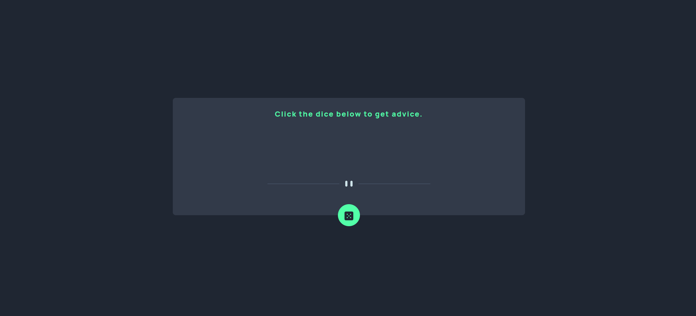
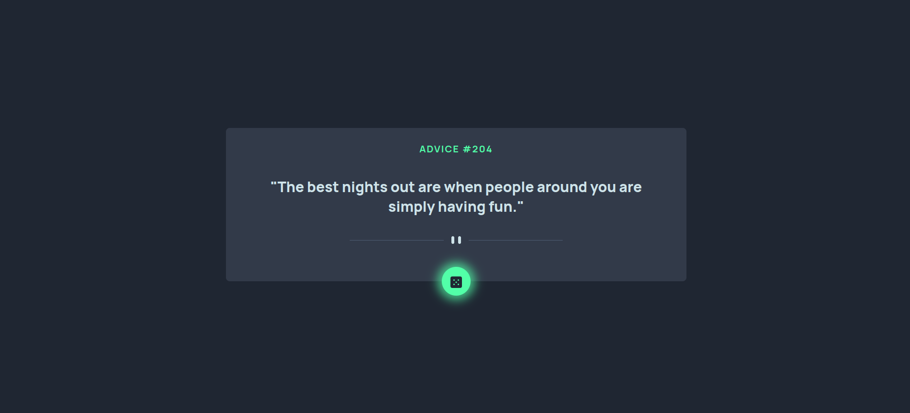

# Advice Generator Application

## Introduction

Welcome to the Advice Generator Application. I built this application using the React Frontend Library. I completed this project as part of my ongoing efforts to grow my skills in Frontend Development. The project required me to build a user interface and integrate the [Advice Slip API](https://api.adviceslip.com)

This project was completed as part of the Frontend Mentor challenge.

### Links

Solution URL: [Github](https://github.com/wilsonsiaw/advice_generator_app)
Live URL: [Live Demo](https://advice-generator-app-bay-six.vercel.app/)

### Built with

- 
- 

### Deployed with

- 

### Features of the project

The project has a single page. There is a button that users are asked to click on. Once the button is clicked, the user interface displays a piece of advice to the user.

### What I learned

In addition to building the user interface, I learned how to integrate an API into a project and have the user interface change based on the data returned from the API.

### Author

- Website: [Wilson Siaw](https://portfolio-webpage-woad.vercel.app/)
- Frontend Mentor: [@wilsonsiaw](https://www.frontendmentor.io/profile/wilsonsiaw)
- Twitter: [@data_wilson](https://twitter.com/data_wilson)
- LinkedIn: [wilson-siaw](https://www.linkedin.com/in/wilson-siaw/)

